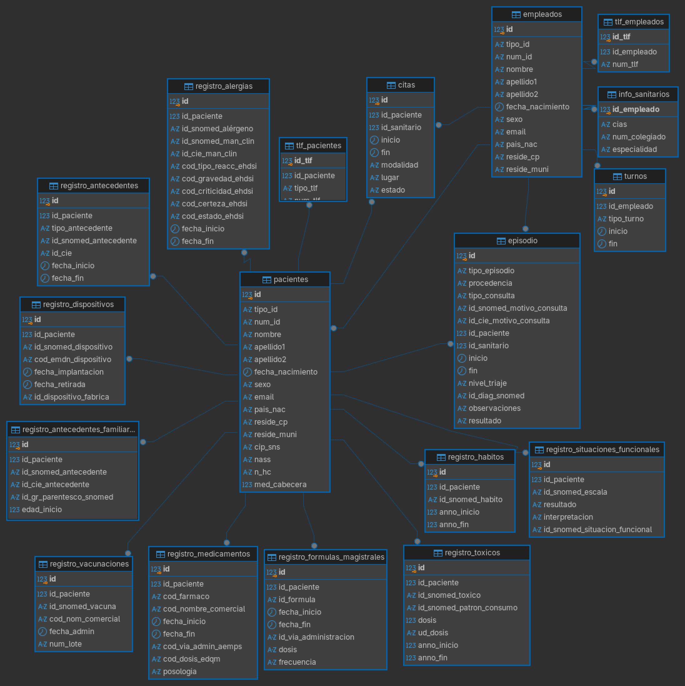

# Información sobre el esquema relacional

## Esquema

## Registro de pacientes y personal

Datos identificativos y de contacto de pacientes y personal sanitario y no sanitario.
Médico de cabecera asociado a cada paciente.
Turnos atendidos por el personal.

### Datos principales

Se encontrarán como atributos de las tablas `empleados` o `pacientes`, a excepción de los teléfonos que se encuentran en
tablas separadas.

- DNI/NIE: No funciona como clave primaria porque se contempla la posibilidad de duplicados. 2 columas (tipo y nº de identificación)
- Nombre, apellidos, fecha de nacimiento y sexo.
- El apellido 2 puede ser opcional.
- Correo electrónico, país de nacimiento y datos de residencia:
- El país de nacimiento admite ZZZ cuando se desconoce.
- El correo electrónico puede ser compartido.
- Los datos de residencia emplean códigos ISO y contemplan vivienda en el extranjero. Solo se almacena 1 domicilio por persona.
- Teléfonos: se almacenan en una tabla separada (varios teléfonos por persona) usando una clave foránea que referencia
a `pacientes.id` o `empleados.id` (claves subrogadas). Los teléfonos se almacenan en formato E.164 estricto.

#### Datos exclusivos de empleados

La información de sanitarios y los turnos se almacenan en sus propias tablas.

- Información de sanitarios: se almacena en una tabla separada para separar la información del personal sanitario  del resto de empleados. Identifica al empleado por número de colegiado, y su plaza por CIAS.

- Turnos: fecha y horas de entrada y salida de todos los empleados en formato timestamp. Distingue turnos ordinarios de guardias.

#### Datos exclusivos de pacientes

Se puede encontrar como atributo en la tabla pacientes:

- Identificadores adicionales: codigo de identificación personal (CIP) del sistema nacional de salud y número de afiliación a la seguridad social
- Médico de cabecera asignado (FK) a `empleados.id`
- Número de historia clínica.

## Registro de actividad asistencial

### Registro de citas

Registra las citas programadas entre pacientes y personal sanitario, las horas de inicio y fin previstas
y el estado dentro del ciclo de la cita.

- Paciente y sanitario.
- Inicio y fin previstos: representan tiempos previstos, no necesariamente el momento real de la atención.
- Modalidad: presencial o telemática.
- Lugar: opcional. Puede ser una consulta.
- Estado: Pendiente_aceptación, Aceptada, Cancelada, Finalizada, No presentado.

### Registro de episodios

Registra episodios asistenciales, tanto ordinarios como de urgencias.

- Tipo y procedencia de la atención.
- Tipo de consulta.
- Motivo de consulta mediante identificadores SNOMED y CIE.
- ID del paciente y el sanitario responsable.
- Inicio y fin.
- Nivel de triaje: en caso de urgencias. Azul, Verde, Amarillo, Naranja o Rojo.
- Diagnóstico SNOMED.
- Observaciones
- Resultado: alta, derivación o pruebas.

## Registros de historia clínica electrónica

Las secciones a continuación explican las decisiones de diseño y la información almacenada respecto a los registros de la historia clínica electronica de los pacientes. Cada los registro irán asignado a un solo paciente

La información almacenada respecto a antecedentes, antecedentes familiares, dispositivos, alergias, vacunaciones, hábitos, consumo de tóxicos, tratamientos y situaciones funcionales irá almacenada en las relaciones descritas a continuación, utilizando atributos codificados cuando sea necesario.

### Codificaciones utilizadas

- SNOMED CT: terminología de uso general. Antecedentes, antecedentes familiares, dispositivos, alergias, vacunas, hábitos,
tóxicos, escalas y situaciones funcionales.
- CIE-10: manifestaciones/antecedentes clínicos donde se ha incluido un código CIE.
- EMDN: Clasificación/codificación de dispositivos médicos.
- Tablas eHDSI: Códigos permitidos para tipo de reacción, gravedad, criticidad, certeza y estado de alergias.
- Nomenclátor Código de fármaco/principio activo y nombre comercial en el registro de medicamentos.
- EDQM Codificación de la dosis en medicamentos.
- AEMPS Código de vía de administración de medicamentos.

### Antecedentes

La tabla `registro_antecedente` agrupa antecedentes que comparten una estructura común: enfermedad
previa, neonatal, obstétrico. quirúrgico, social o profesional. Los antecedentes familiares y de uso de dispositivo se almacenan
en tablas separadas (`registro_antecedentes_familiares` y `registro_dispositivo` respectivamente).

Todos los antecedentes en general tendran los siguientes atributos:

- Código de SNOMED CT y otros identificadores (ver sección de codificaciones utilizadas).
- Fechas de inicio y fin del antecedente.

En el caso de antecedentes familiares:

- Grado de parentesco (SNOMED CT)
- Edad de inicio si se conoce en lugar de fechas de inicio y fin.

En el caso de dispositivos:

- Fecha de implantación y retirada en lugar de fechas de inicio y fin.
- Identificador de fábrica del dispositivo

### Alergias

Identificación del alérgeno:

- `id_snomed_alérgeno`: Código SNOMED CT del Alérgeno

Identificación de manifestación clínica:

- `id_snomed_man_clin`: Código SNOMED CT de manifestación clínica de la alergia
- `id_cie_man_clin`: Código CIE-10 de manifestación clínica de la alergia, en caso de estar disponible.

[Códigos EHDSI](https://art-decor.ehdsi.eu/publication/epsos-html-20201215T191920/terminology.html) para describir la reacción:

- `cod_tipo_reacc_ehdsi`: tipo de reacción
- `cod_gravedad_ehdsi`: gravedad
- `cod_criticidad_ehdsi`: criticidads
- `cod_certeza_ehdsi`: certeza
- `cod_estado_ehdsi`: estado

Fechas de inicio y fin de alergia:

- `fecha_inicio`
- `fecha_fin`

### Vacunaciones

Registro solo para vacunas administradas, no planificadas ni pendientes en la cartilla de vacunación.

- `id_snomed_vacuna`: código snomed de la vacuna
- `cod_nom_comercial`: codigo de nombre comercial en el nomenclator de la AEMPS.
- `fecha_admin`: fecha de administración
- `num_lote`: nº de lote de vacuna para trazabilidad

### Hábitos perjudiciales y uso de sustancias tóxicas

En ambos casos se registra:

- código de SNOMED CT del hábito perjudicial o toxico.
- año de inicio
- año de fin

En el caso de las sustancias toxicas si se conoce:

- `id_snomed_patron_consumo`: código SNOMED CT del patron de consumo
- `dosis`: dosis de consumo
- `ud_dosis`: unidades de dosis de consumo

### Medicamentos y fórmulas magistrales

Se registran por separado los medicamentos prescritos y las fórmulas magistrales, ya que utilizan sistemas de codificación y estructuras diferentes.

#### Medicamentos

El registro de medicamentos incluye:

- Código de fármaco/principio activo según el Nomenclátor.
- Código del nombre comercial, también según el Nomenclátor, cuando esté disponible.
- Fecha de inicio y fecha de fin del tratamiento.
- Vía de administración mediante el código correspondiente de la AEMPS.
- Dosis codificada según EDQM.
- Posología del tratamiento.

La **dosis** identifica la cantidad administrada del medicamento mediante la codificación EDQM, mientras que la **posología** describe cómo se utiliza el medicamento dentro del tratamiento.

#### Fórmulas magistrales

Las fórmulas magistrales se almacenan en una relación independiente porque no utilizan la misma estructura de codificación que los medicamentos.

El registro incluye:

- Identificador de la fórmula magistral.
- Fecha de inicio y fecha de fin.
- Vía de administración.
- Dosis.
- Frecuencia de administración.

En este caso, la dosis se almacena directamente como texto y no mediante EDQM. Además, se registra la frecuencia de administración en lugar de la posología completa utilizada para los medicamentos.

### Situaciones funcionales

Se registran las situaciones funcionales de los pacientes junto con la escala utilizada para su valoración.

Cada registro incluye:

- `id_snomed_escala`: código SNOMED CT correspondiente a la escala utilizada.
- `resultado`: resultado obtenido en la escala.
- `interpretacion`: interpretación del resultado.
- `id_snomed_situacion_funcional`: código SNOMED CT de la situación funcional evaluada.

Cada registro está asociado a un único paciente mediante `id_paciente`.
